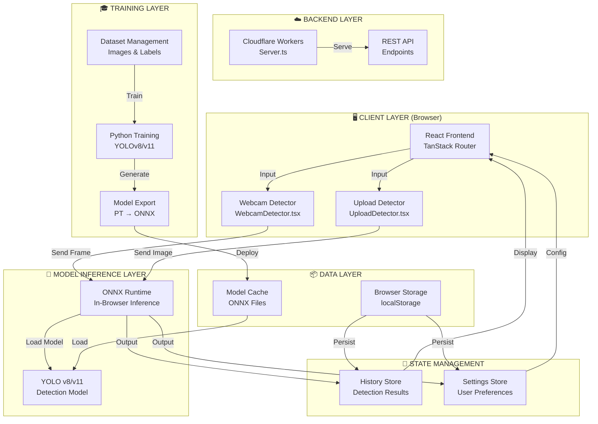
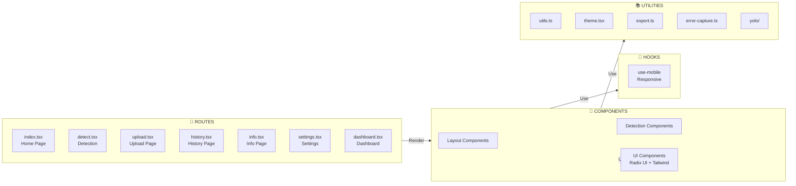
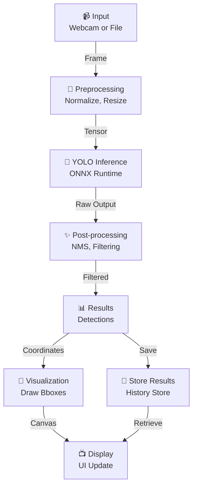
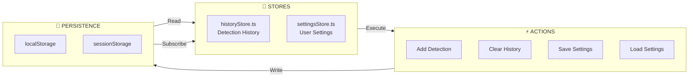
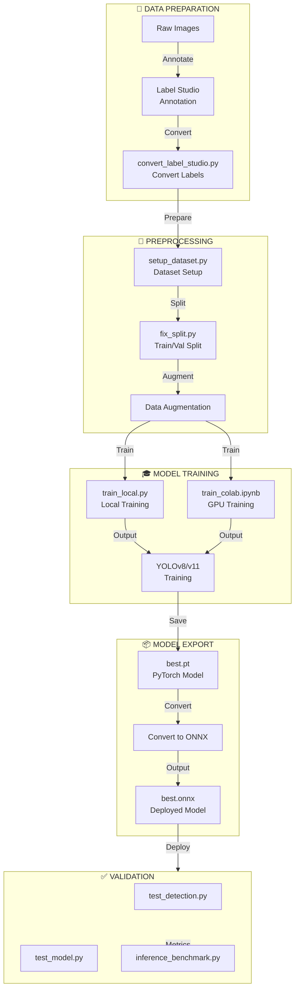
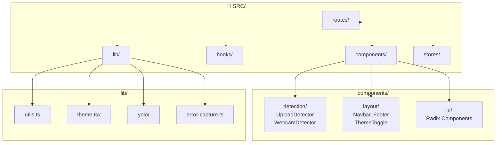
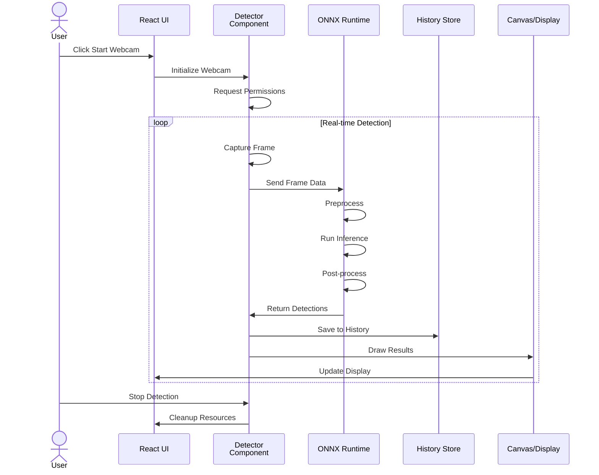
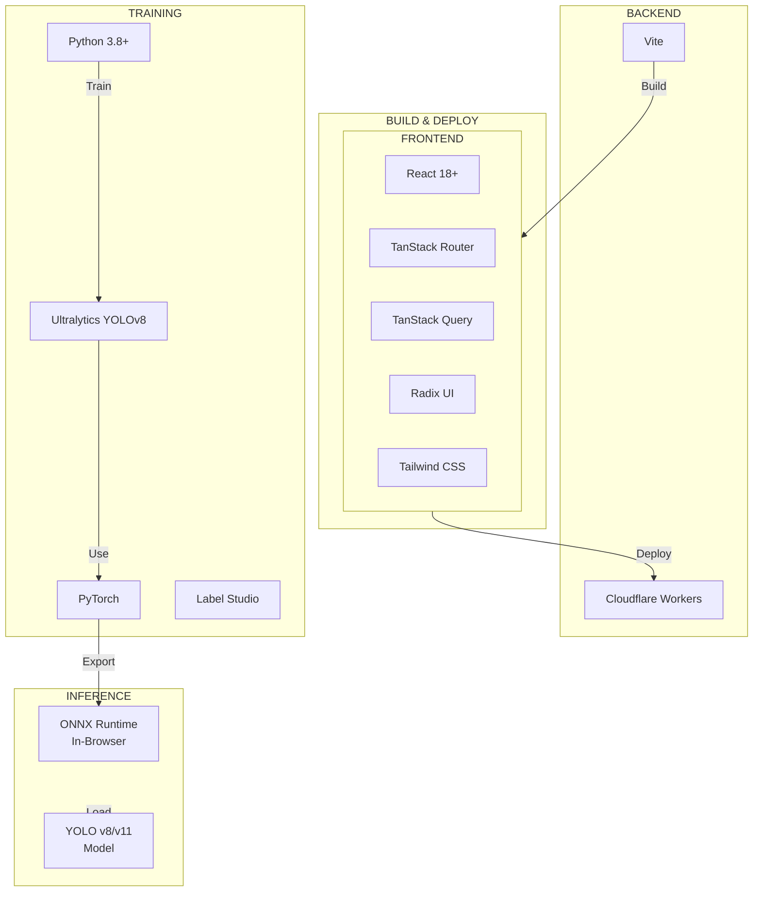
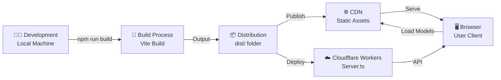
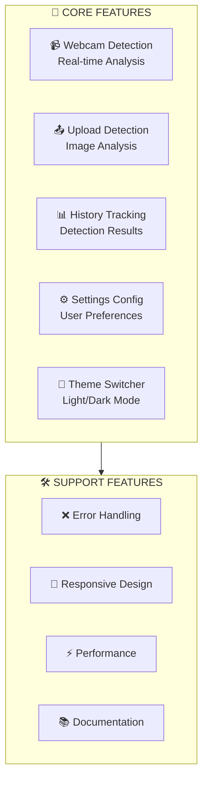

# Diagram Arsitektur Sistem SawoVision

## 1. Arsitektur Keseluruhan (System Architecture)

---

## 2. Frontend Architecture (Presentasi Layer)

---

## 3. Detection Pipeline (Real-time Flow)

---

## 4. State Management Architecture

---

## 5. Model Training Pipeline

---

## 6. File Structure & Components

---

## 7. Data Flow: Deteksi Real-time

---

## 8. Technology Stack

---

## 9. Deployment Architecture

---

## 10. Key Features Architecture

---

## Catatan Arsitektur:

1. **Frontend-First Architecture**: Model inference berjalan di browser (ONNX Runtime) untuk latency rendah
2. **Server-Side Rendering**: Menggunakan TanStack Start untuk SSR capabilities
3. **State Management**: Zustand untuk history dan settings store
4. **Model Format**: PyTorch untuk training, ONNX untuk deployment
5. **Responsive Design**: Mobile-first dengan Tailwind CSS + Radix UI
6. **Training Pipeline**: Python-based untuk model development
7. **Scalable**: Cloudflare Workers untuk backend scalability
