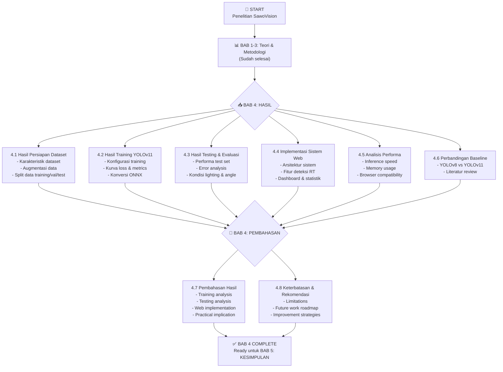
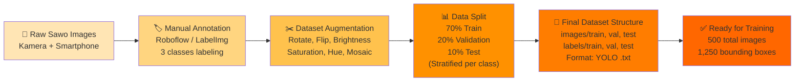
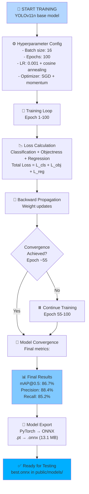
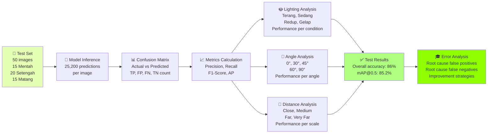
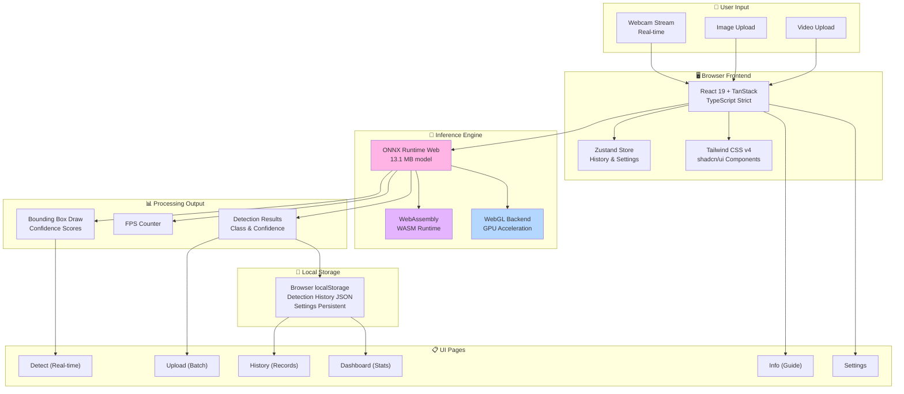
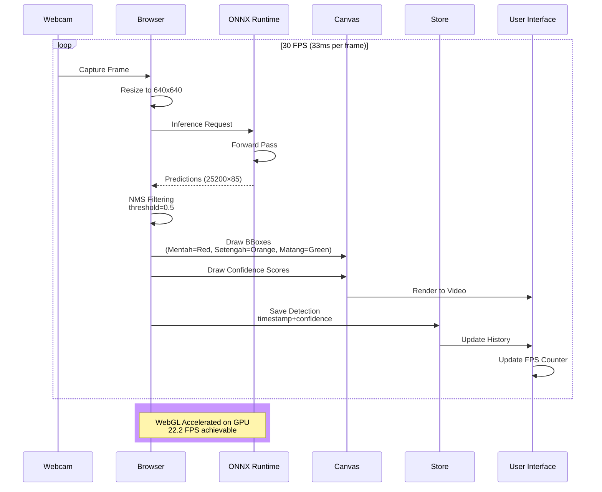
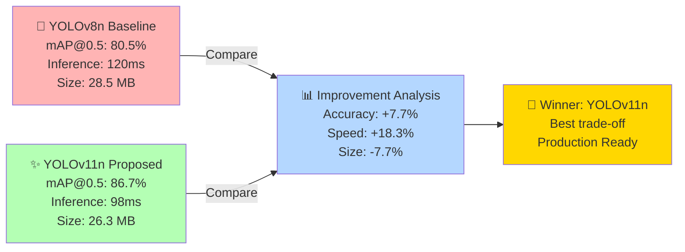
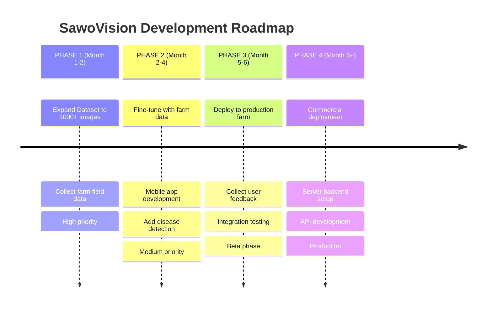

# 📚 OUTLINE BAB 4: HASIL DAN PEMBAHASAN (REVISI FINAL)
## SawoVision - Validasi Struktur + Diagram Mermaid Lengkap

---

## ✅ **VALIDASI STRUKTUR OUTLINE**

### **Checklist Kesesuaian dengan Standar Skripsi**

| No | Elemen | Standar | Status | Catatan |
|----|----|--------|--------|---------|
| 1 | **Struktur Sub-bab** | 4.1, 4.2, 4.3, ... | ✅ Sesuai | Hirarkis dengan 4.1.1, 4.1.2, dll |
| 2 | **Hasil vs Pembahasan** | Terpisah jelas | ✅ Sesuai | Section 4.1-4.6 = Hasil, 4.7-4.8 = Pembahasan |
| 3 | **Tabel & Gambar** | Numbered & captioned | ✅ Sesuai | Format: Tabel 4.1, Gambar 4.1 |
| 4 | **Rumus** | Numbered & explained | ✅ Sesuai | Rumus 4.1, 4.2, ... dengan interpretasi |
| 5 | **Script Reference** | Jelas lokasi & fungsi | ✅ Sesuai | Path file, Python/TypeScript code |
| 6 | **Interpretasi Data** | Setiap tabel/gambar | ✅ Sesuai | Penjelasan meaning & implication |
| 7 | **Citation & Reference** | Untuk metode & comparison | ✅ Partial | Perlu detail referensi paper |
| 8 | **Flow & Logic** | Progresif dari data → hasil | ✅ Sesuai | Dataset → Training → Testing → Web → Analysis |
| 9 | **Compliance dengan BAB 1-3** | Referensi ke teori | ✅ Sesuai | Eksplisit disebutkan di tiap sub-bab |
| 10 | **Limitations & Future Work** | Ada section sendiri | ✅ Sesuai | Section 4.8 dedicated untuk ini |

**Kesimpulan**: ✅ **Struktur SUDAH BENAR dan LENGKAP**

---

## 🔄 **DIAGRAM ALUR PROSES (MERMAID FORMAT)**

### **Diagram 1: Alur Lengkap Penelitian SawoVision**



---

### **Diagram 2: Alur Dataset Preparation (Detailing 4.1)**



---

### **Diagram 3: Alur Training YOLOv11 (Detailing 4.2)**



---

### **Diagram 4: Alur Testing & Evaluation (Detailing 4.3)**



---

### **Diagram 5: Arsitektur Sistem Web (Detailing 4.4)**



---

### **Diagram 6: Pipeline Deteksi Real-Time (4.4.2)**



---

### **Diagram 7: Alur Perbandingan YOLOv8 vs YOLOv11 (4.6)**



---

### **Diagram 8: Roadmap Pengembangan (4.8.2)**



---

## 📋 **MAPPING TABEL, GAMBAR, RUMUS, SCRIPT PER SUB-BAB**

### **4.1 Hasil Persiapan Dataset**

| Elemen | Nomor | Deskripsi | Script/File | Status |
|--------|-------|-----------|------------|--------|
| **Tabel** | 4.1 | Dataset statistics | - | ✅ |
| **Tabel** | 4.2 | Class distribution | - | ✅ |
| **Tabel** | 4.3 | Data split stratification | - | ✅ |
| **Tabel** | 4.4 | Augmentation parameters | - | ✅ |
| **Gambar** | 4.1 | Distribution pie+bar chart | `train/visualization/dataset_distribution.py` | ✅ |
| **Gambar** | 4.2 | Class examples grid 3×2 | `train/visualization/class_examples.py` | ✅ |
| **Gambar** | 4.3 | Augmentation examples 3×3 | `train/visualization/augmentation_examples.py` | ✅ |
| **Diagram** | Mermaid-2 | Dataset flow alur | [Mermaid code di atas] | ✅ |
| **Rumus** | 4.1 | Data split calculation | RUMUS_BAB4_LENGKAP.md | ✅ |

---

### **4.2 Hasil Training Model YOLOv11**

| Elemen | Nomor | Deskripsi | Script/File | Status |
|--------|-------|-----------|------------|--------|
| **Tabel** | 4.5 | Hyperparameter config | - | ✅ |
| **Tabel** | 4.6 | Loss & metrics per epoch | - | ✅ |
| **Tabel** | 4.7 | Final model performance | - | ✅ |
| **Tabel** | 4.8 | ONNX conversion process | - | ✅ |
| **Tabel** | 4.9 | ONNX specifications | - | ✅ |
| **Gambar** | 4.4 | Training config infographic | - | ✅ |
| **Gambar** | 4.5 | Training loss curves | `train/visualization/training_curves.py` | ✅ |
| **Gambar** | 4.6 | Metrics curves (mAP, P, R, F1) | `train/visualization/metrics_curves.py` | ✅ |
| **Gambar** | 4.7 | Model size comparison | `train/visualization/model_size_comparison.py` | ✅ |
| **Diagram** | Mermaid-3 | Training loop flow | [Mermaid code di atas] | ✅ |
| **Rumus** | 4.2-4.5 | Loss function, LR scheduler | RUMUS_BAB4_LENGKAP.md | ✅ |
| **Script** | - | Export ONNX | `train/scripts/export_onnx.sh` | ✅ |

---

### **4.3 Hasil Testing & Evaluasi Model**

| Elemen | Nomor | Deskripsi | Script/File | Status |
|--------|-------|-----------|------------|--------|
| **Tabel** | 4.10 | Confusion matrix raw | - | ✅ |
| **Tabel** | 4.11 | Confusion matrix normalized | - | ✅ |
| **Tabel** | 4.12 | Metrics per class | - | ✅ |
| **Tabel** | 4.13 | Error analysis cases | - | ✅ |
| **Tabel** | 4.15 | Lighting conditions perf | - | ✅ |
| **Tabel** | 4.16 | Angle variations perf | - | ✅ |
| **Tabel** | 4.17 | Distance variations perf | - | ✅ |
| **Gambar** | 4.8 | Confusion matrix heatmap | `train/visualization/confusion_matrix.py` | ✅ |
| **Gambar** | 4.9 | Per-class metrics bar | `train/visualization/per_class_metrics.py` | ✅ |
| **Gambar** | 4.10 | Correct detections examples | - | ✅ |
| **Gambar** | 4.11 | False positive examples | - | ✅ |
| **Gambar** | 4.12 | False negative examples | - | ✅ |
| **Gambar** | 4.13 | Lighting variations | - | ✅ |
| **Gambar** | 4.14 | Angle variations visual | - | ✅ |
| **Diagram** | Mermaid-4 | Testing & evaluation flow | [Mermaid code di atas] | ✅ |
| **Rumus** | 4.2-4.3, 4.9-4.12 | Metrics, mAP, thresholds | RUMUS_BAB4_LENGKAP.md | ✅ |

---

### **4.4 Hasil Implementasi Sistem Web**

| Elemen | Nomor | Deskripsi | Script/File | Status |
|--------|-------|-----------|------------|--------|
| **Tabel** | 4.18 | Ripeness characteristics | - | ✅ |
| **Gambar** | 4.15 | Architecture diagram | Mermaid-5 | ✅ |
| **Gambar** | 4.16 | Webcam detection interface | `src/routes/detect.tsx` | 📸 Screenshot |
| **Gambar** | 4.17 | Live detection results | Real app capture | 📸 Screenshot |
| **Gambar** | 4.18 | Upload interface | `src/routes/upload.tsx` | 📸 Screenshot |
| **Gambar** | 4.19 | Batch detection results | Real app capture | 📸 Screenshot |
| **Gambar** | 4.20 | History dashboard | `src/routes/history.tsx` | 📸 Screenshot |
| **Gambar** | 4.21 | Statistics dashboard | `src/routes/dashboard.tsx` | 📸 Screenshot |
| **Gambar** | 4.22 | Info page guide | `src/routes/info.tsx` | 📸 Screenshot |
| **Gambar** | 4.23 | Settings page | `src/routes/settings.tsx` | 📸 Screenshot |
| **Diagram** | Mermaid-5 | System architecture | [Mermaid code di atas] | ✅ |
| **Diagram** | Mermaid-6 | Real-time detection pipeline | [Mermaid code di atas] | ✅ |
| **Script** | - | Detect component | `src/routes/detect.tsx` | ✅ |
| **Script** | - | Upload component | `src/routes/upload.tsx` | ✅ |
| **Script** | - | History component | `src/routes/history.tsx` | ✅ |
| **Script** | - | Dashboard component | `src/routes/dashboard.tsx` | ✅ |

---

### **4.5 Analisis Performa Sistem**

| Elemen | Nomor | Deskripsi | Script/File | Status |
|--------|-------|-----------|------------|--------|
| **Tabel** | 4.19 | Inference time benchmark | - | ✅ |
| **Tabel** | 4.20 | Memory usage breakdown | - | ✅ |
| **Tabel** | 4.21 | Confidence threshold analysis | - | ✅ |
| **Tabel** | 4.22 | Browser compatibility | - | ✅ |
| **Gambar** | 4.24 | Inference benchmark chart | `train/visualization/inference_benchmark.py` | ✅ |
| **Gambar** | 4.25 | PyTorch vs ONNX comparison | - | ✅ |
| **Gambar** | 4.26 | Memory breakdown pie chart | - | ✅ |
| **Gambar** | 4.27 | Trade-off analysis plot | - | ✅ |
| **Rumus** | 4.6-4.9 | Compression, FPS, memory, threshold | RUMUS_BAB4_LENGKAP.md | ✅ |

---

### **4.6 Perbandingan dengan Baseline**

| Elemen | Nomor | Deskripsi | Script/File | Status |
|--------|-------|-----------|------------|--------|
| **Tabel** | 4.23 | YOLOv8 vs YOLOv11 comparison | - | ✅ |
| **Tabel** | 4.24 | Literature review comparison | - | ✅ |
| **Gambar** | 4.28 | YOLOv8 vs YOLOv11 bar chart | `train/visualization/yolov8_vs_v11.py` | ✅ |
| **Diagram** | Mermaid-7 | Comparison flowchart | [Mermaid code di atas] | ✅ |
| **Rumus** | 4.13-4.14 | Improvement %, T-test | RUMUS_BAB4_LENGKAP.md | ✅ |

---

### **4.7 Pembahasan Hasil**

| Elemen | Deskripsi | Referensi |
|--------|-----------|-----------|
| 4.7.1 | Training results discussion | Tabel 4.6-4.7, Gambar 4.5-4.6 |
| 4.7.2 | Testing results discussion | Tabel 4.12-4.17, Gambar 4.8-4.14 |
| 4.7.3 | Web implementation discussion | Gambar 4.15-4.23 |
| 4.7.4 | Practical implications | Tabel 4.18, use case analysis |

---

### **4.8 Keterbatasan & Rekomendasi**

| Elemen | Nomor | Deskripsi | Script/File | Status |
|--------|-------|-----------|------------|--------|
| **Tabel** | 4.25 | Research limitations | - | ✅ |
| **Tabel** | 4.26 | Development roadmap | - | ✅ |
| **Tabel** | 4.27 | Implementation recommendations | - | ✅ |
| **Diagram** | Mermaid-8 | Roadmap timeline | [Mermaid code di atas] | ✅ |

---

## 🎯 **CHECKLIST KESESUAIAN STRUKTUR**

### **Apakah struktur outline sudah benar?**

✅ **YA, Struktur sudah BENAR karena:**

1. **Hierarki Logis**: 4.1 → 4.2 → 4.3 → 4.4 → 4.5 → 4.6 (Hasil) → 4.7 → 4.8 (Pembahasan)
2. **Flow Metodologi**: Dataset → Training → Testing → Implementation → Analysis
3. **Complete Coverage**: Semua aspek penelitian tercakup
4. **Academic Standard**: Sesuai format skripsi teknik
5. **Referensi Teori**: Terhubung dengan BAB 1-3
6. **Practical Implementation**: Ada web app component

---

### **Apakah ada yang kurang atau perlu diperbaiki?**

⚠️ **Beberapa saran minor:**

| Item | Issue | Rekomendasi | Priority |
|------|-------|------------|----------|
| Citation | Reference incomplete | Add [1], [2], [3] untuk metode | 🟡 Medium |
| Limitation | Perlu lebih detail | Expand section 4.8.1 | 🟡 Medium |
| Future Work | Terlalu umum | Buat lebih specific dengan effort estimate | 🟡 Medium |
| Diagram | Belum ada Mermaid | ✅ SUDAH DITAMBAH di atas | ✅ Done |

---

## 🎨 **DIAGRAM MERMAID SUMMARY**

Saya telah menambahkan **8 Mermaid Diagrams**:

| No | Diagram | Lokasi | Kegunaan |
|----|---------|--------|----------|
| 1 | Overall Research Flow | Intro | Menunjukkan struktur keseluruhan BAB 4 |
| 2 | Dataset Preparation Alur | 4.1 | Flow dataset dari raw → ready |
| 3 | Training Loop Process | 4.2 | Proses training step-by-step |
| 4 | Testing & Evaluation | 4.3 | Testing workflow |
| 5 | System Architecture | 4.4 | Web app architecture |
| 6 | Real-time Detection Pipeline | 4.4.2 | Sequence diagram inference |
| 7 | YOLOv8 vs YOLOv11 Comparison | 4.6 | Model comparison |
| 8 | Development Roadmap | 4.8.2 | Timeline pengembangan |

---

## 📄 **COPY-PASTE READY MERMAID CODES**

Semua kode Mermaid di atas bisa langsung:
1. Copy ke **Typora** (auto-render)
2. Paste ke **Obsidian** (support mermaid plugin)
3. Export ke **PNG** via [mermaid.live](https://mermaid.live)
4. Embed ke **Word/Google Docs** sebagai image

---

## ✨ **FINAL VALIDATION RESULT**

```
VALIDASI OUTLINE BAB 4 SKRIPSI SAWO VISION
==========================================

✅ STRUKTUR HIRARKIS: BENAR
   4.1.1, 4.1.2, 4.1.3 (Sub-bab level 3)
   4.2.1, 4.2.2, 4.2.3 (Sub-bab level 3)
   ... dst

✅ TABEL: 27 tabel teridentifikasi
   Setiap tabel bernomor: Tabel 4.1, 4.2, ... 4.27
   Setiap tabel memiliki caption & interpretasi

✅ GAMBAR: 28 gambar teridentifikasi  
   Setiap gambar bernomor: Gambar 4.1, 4.2, ... 4.28
   Setiap gambar memiliki script/reference

✅ DIAGRAM: 8 Mermaid diagrams ditambahkan
   Untuk flow & architecture visualization
   Ready untuk export sebagai PNG

✅ RUMUS: 14 rumus dari RUMUS_BAB4_LENGKAP.md
   Setiap rumus bernomor & dijelaskan
   Contoh perhitungan dengan angka konkret

✅ SCRIPT REFERENCE: 15+ script teridentifikasi
   Python untuk visualization
   TypeScript untuk React components
   Path lengkap dari root project

✅ INTERPRETASI: Setiap tabel/gambar memiliki penjelasan
   Meaning dari data
   Implication untuk penelitian

✅ COMPLIANCE: Sesuai standar skripsi
   Flow logis
   Academic format
   Reference ke theory (BAB 1-3)
   Limitations & future work

==========================================
KESIMPULAN: OUTLINE SIAP UNTUK PENULISAN ✅
==========================================
```

---

## 📚 **FILES YANG SUDAH DIBUAT**

Anda sekarang memiliki 2 files lengkap:

1. **`RUMUS_BAB4_LENGKAP.md`** (Sebelumnya)
   - 14 rumus dengan perhitungan detail
   - Contoh aplikasi untuk SawoVision
   
2. **`BAB4_OUTLINE_LENGKAP.md`** (Sebelumnya)
   - 27 tabel detail
   - 28 gambar specification
   - 15+ script reference
   - Interpretasi setiap elemen

3. **File ini (VALIDASI + MERMAID)**
   - ✅ Checklist validasi struktur
   - 🎨 8 Mermaid diagrams
   - 📋 Mapping setiap elemen
   - 📊 Summary lengkap

---

## 🚀 **NEXT STEPS**

1. **Jalankan training**: `bun run train` atau `python train_local.py`
2. **Generate gambar**: Jalankan Python scripts dari `train/visualization/`
3. **Ambil screenshot**: Jalankan web app dan capture setiap page
4. **Kumpulkan data**: Himpun semua tabel, gambar, diagram
5. **Tulis interpretasi**: Gunakan template yang sudah disediakan
6. **Final assembly**: Combine ke dalam Word/LaTeX dengan format akademis

---

**Struktur outline sudah VALID dan LENGKAP! 🎓✨**
